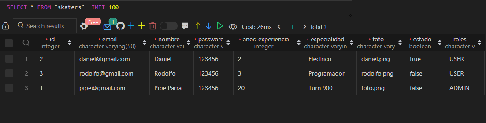

 <h1 align= left ><b>Sprint M8 / EquipoBoldo</b> </h1>

<br>

<h2><b>Sprint</b> </h2>

La Municipalidad de Santiago, ha organizado una competencia de Skate para impulsar el nivel deportivo de los
jóvenes que desean representar a Chile en los X Games próximos, y han iniciado con la gestión para desarrollar la
plataforma web en la que los participantes se podrán registrar y revisar el estado de su solicitud.
En esta prueba deberás ocupar todos tus conocimientos para desarrollar un sistema que involucre tus habilidades
como Full Stack Developer, consolidando tus competencias en el frontend y backend.
Lastecnologías y herramientas que deberás ocuparson lassiguientes:
● Express
● Handlebars
● MySQL
● JWT
● Express-fileupload

Indicaciones:
● Elsistema debe permitir registrar nuevos participantes.
● Se debe crear una vista para que los participantes puedan iniciarsesión con su correo y contraseña.
● Luego de iniciar la sesión, los participantes deberán poder modificar sus datos, exceptuando el correo

electrónico y su foto. Esta vista debe estar protegida con JWT y los datos que se utilicen en la planilla deben
ser extraídos del token.
● La vista correspondiente a la ruta raíz debe mostrar todos los participantes registrados y su estado de
revisión.
● La vista del administrador debe mostrar los participantes registrados y permitir aprobarlos para cambiar su
estado.

<br>

<h2><b>Instrucciones de Instalación</b> </h2> 

⚙️ Para instalar las dependencias necesarias, sigue los siguientes pasos:

1. Clona el repositorio en tu máquina local.
2. Abre una terminal y navega hasta la carpeta del proyecto.
3. Ejecuta el siguiente comando para instalar las dependencias:

   npm install

4. Abrir el archivo html ingresando al https://localhost:3000
5. Para ejecutar: node server.js o en su defecto con nodemon server.js


<br>

<details>  <summary><b>Ver las instrucciones</b></summary> 


1. Instalar las dependencias:

   ```sh
   npm install
   ```

2. En el caso de no poder instalar las dependencias:

   ```sh
   npm install --force
   ```

3. Las librerias que estamos ocupando `package.json`:

    ````sh
    ... 
    "name": "helpers",
    "version": "1.0.0",
    "description": "",
    "main": "index.js",
    + "type": "module",
    "scripts": {
    "test": "echo \"Error: no test specified\" && exit 1"
    },
    "author": "",
    "license": "ISC",
    "dependencies": {
    "dotenv": "^16.3.1",
    "express": "^4.18.2",
    "express-fileupload": "^1.4.0",
    "express-handlebars": "^6.0.6",
    "express-session": "^1.17.3",
    "jsonwebtoken": "^8.5.1",
    "jwk": "^0.0.2",
    "pg": "^8.11.3",
    "uuid": "^8.3.2"
    }
    ````

 
</details>

## Se Evalua :sparkles:

✨ Puntos a evaluar:
Requerimientos:
1. Crear una API REST con el Framework Express (3pts)
2. Servir contenido dinámico con express-handlebars(3pts)
3. Ofrecer la funcionalidad Upload File con express-fileupload (2pts)
4. Implementarseguridad y restricción de recursos o contenido con JWT (2pts) 


<br>

<h2><b>Base de Datos</b> </h2>




<br>

<h2><b>GITHUB</b> </h2>

1. Loreto Godoy : https://github.com/loreGodoyUp

2. Daniel Mendez : https://github.com/danimen81

3. Zimram Blanco : https://github.com/Zimram

4. Jose Fuentealba : https://github.com/JoseFelipeGeo

5. Boris Guiñez : https://github.com/boanguibe

6. Alfonso Mujica : https://github.com/ALFONSOMUJICAS

7. Felipe Andres Parra : https://github.com/33fparra


### Este proyecto está bajo la licencia ADALID.


